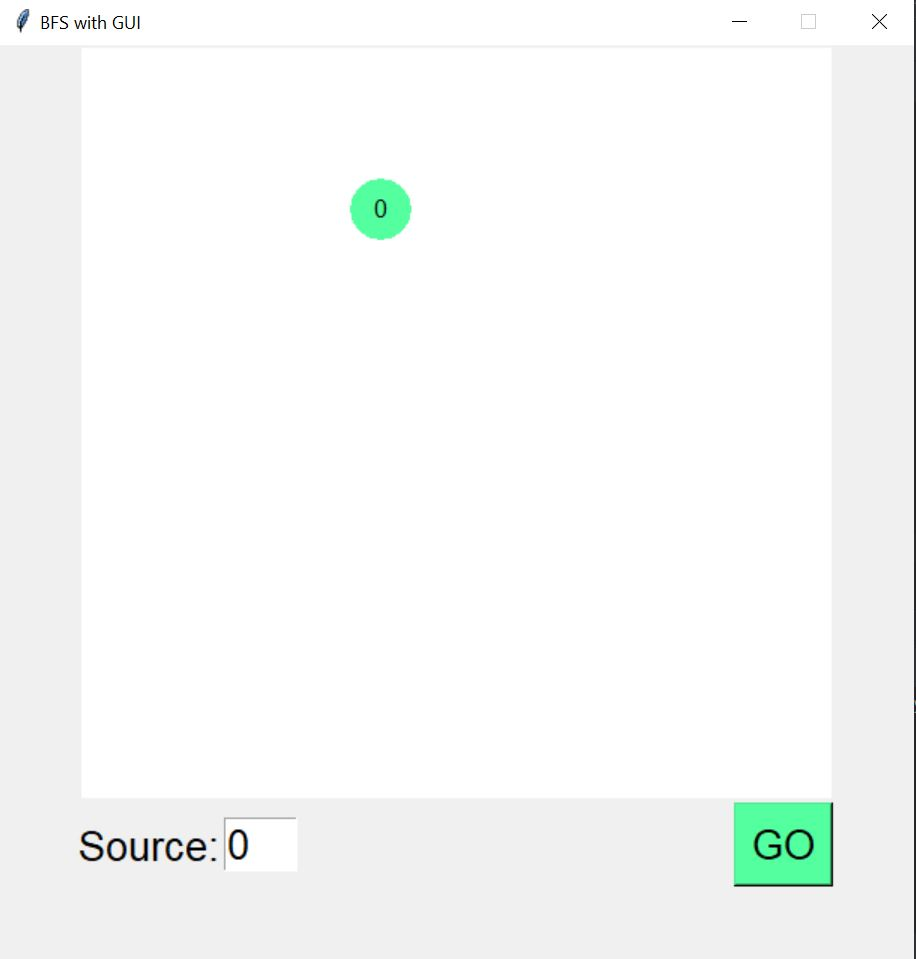
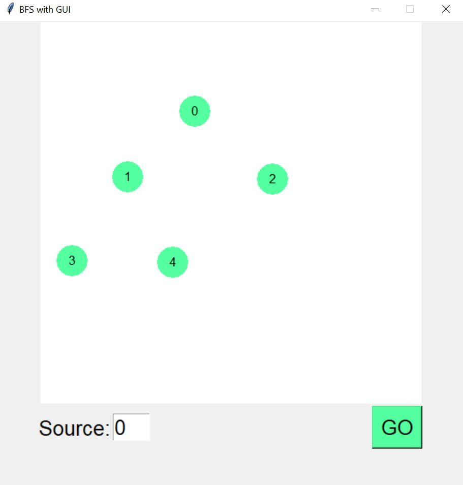
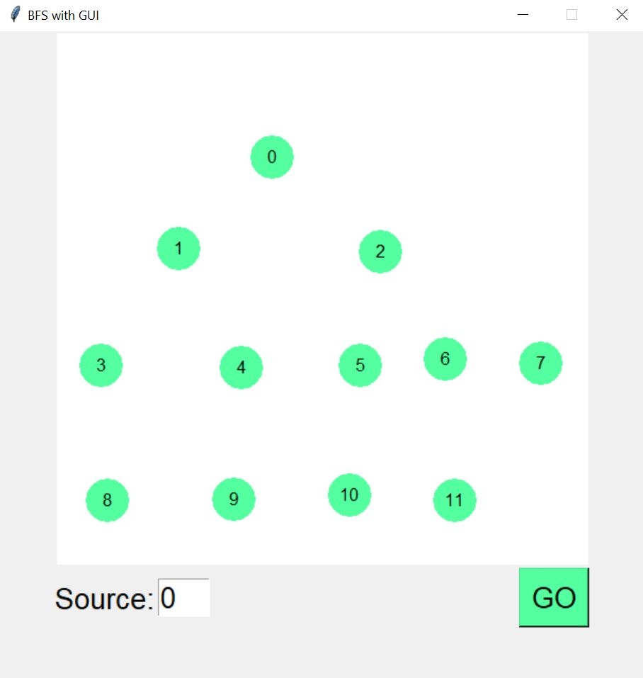

# Visualization-of-BFS-and-DFS

## Execution:    
#### Step 1: Creating Nodes: 
Right click on canvas area creates a new node
 

 
#### Step 2: Creating Edges: 
Drag the mouse between two nodes to create an edge

3. Traversal:  Enter source vertex and click GO
4. Visualization: The program visualizes BFS by changing the colour of node traversed to ‘yellow’ with the delay of 0.5 sec.

 

