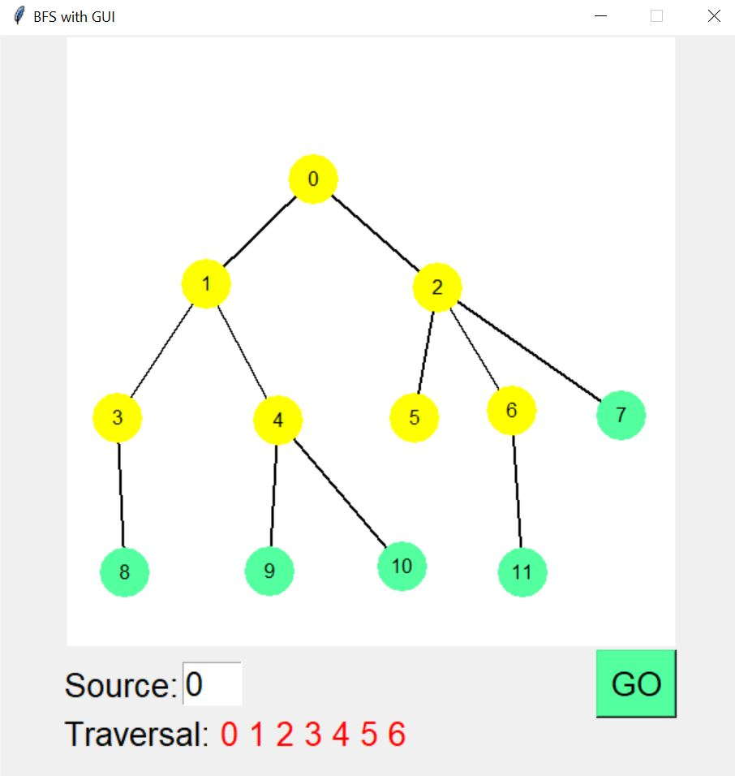

# Visualization-of-BFS-and-DFS

## Execution:    
Step 1: Creating Nodes: Right click on canvas area creates a new node
 

 

Step 2: Creating Edges: Drag the mouse between two nodes to create an edge
 

 

Step 3: Traversal:  Enter source vertex and click GO
 
 
Step 4: Visualization: The program visualizes BFS by changing the colour of node traversed to ‘yellow’ with the delay of 0.5 sec.
 

 

 

